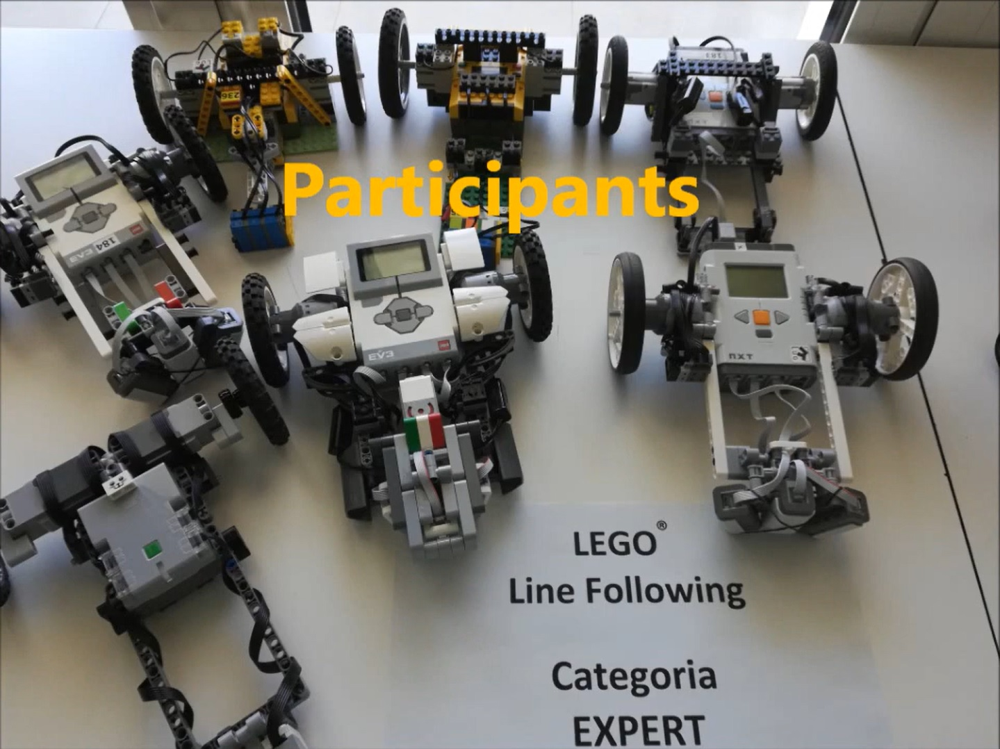
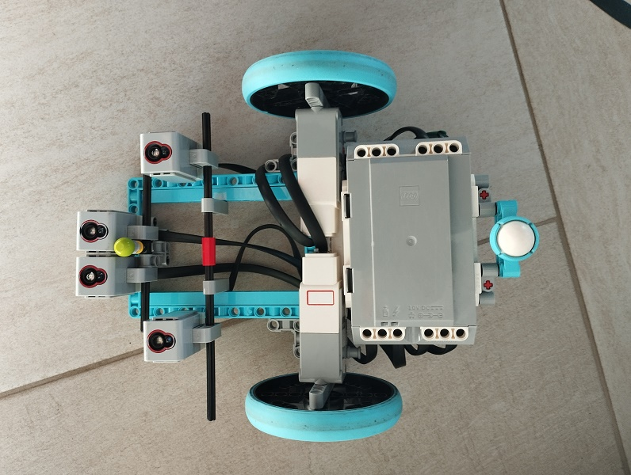
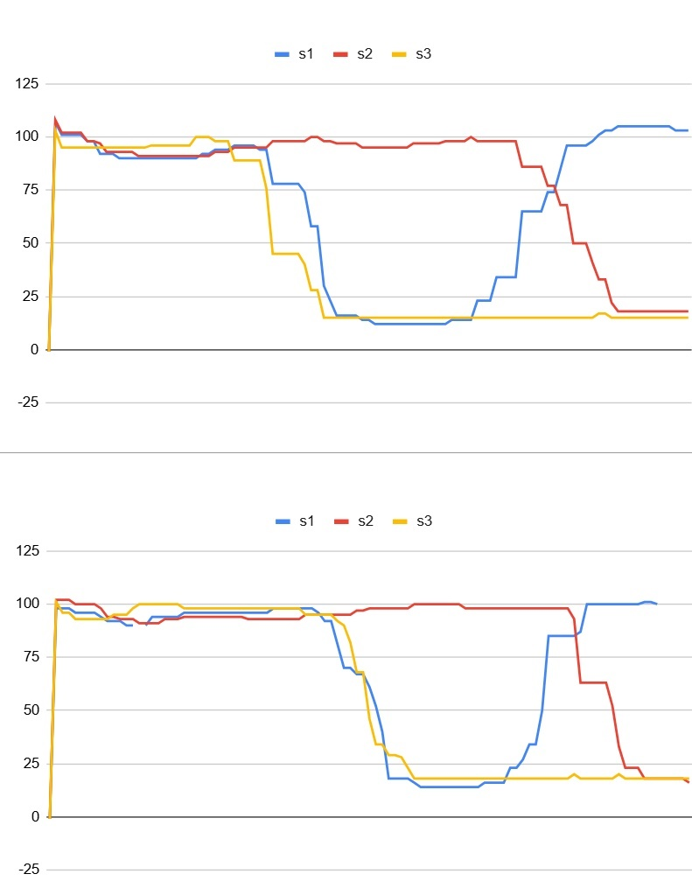

# Vonalkövető Projekt

## Dokumentálás Célja: 
- memorandum
- tanulási lehetőség másoknak

Ez a dokumentáció igyekszig megmutatni és összegyüjti mindazt, ami a 2025-ös Prosuli vonalkövetőversenyével kapcsolatban készült.

## Előzmény:
A vonalkövetési feladatk a robotversenyek leggyakoribb feladatai. (Fll, WRO, RoboCup, RobotOlimpia, stb..) 
Vonalkövetésről készítettünk egy tanulmányt 2015-ben. prezi formában még elérhető: [prezi](https://prezi.com/3eiayjo-uein/lego-robot-programozas/)

## Versenyszabályzat a magyar versenyről:
-[szabályok mentett](mds/2025.Line Following Rules.hu.v.04.07..md)
-[szabályok mentett](mds/2025.Line%20Following%20Rules.hu.v.04.07..md)
-[szabályok online](https://docs.google.com/document/d/1thQl6xXX_qvgtK1BIwJ8JObkCabkKbEllVdfRe9Oe6A/edit?pli=1&tab=t.0#heading=h.xe0xnnmimg7h)

## Versenyszabályok a nemzetközi versenyről:
-[szabályok online](https://robotex.international/wp-content/uploads/2024/07/Line-following-2024-ENG.pdf)

## Inspirációs videók:
[!](https://youtu.be/MHesNWMKTPU)

## RobotC fejlesztőkörnyezetről:
A RobotC a LEGO EV3 programozásában **közvetlen hardvervezérlést** kínál, ami gyors és precíz működést tesz lehetővé a grafikus (EV3-G) vagy Python megoldásokhoz képest.

---
### Előnyök

- **Valós idejű hardver-hozzáférés**  
  Motorok és szenzorok állapota azonnal olvasható és írható.

- **Precíz vezérlés**  
  Pontos ciklusok, időzítés és komplex algoritmusok közvetlen implementálása. Ideális PID szabályozáshoz vagy vonalkövetéshez.

- **Részletes hibakeresés**  
  A változók és szenzorértékek futás közben nyomon követhetők.

- **Teljes hardverhozzáférés**  
  Minden motor és szenzor közvetlenül vezérelhető, nincs “elrejtett réteg”.

---

### Összehasonlítás más megoldásokkal

| Megoldás | Előnyök | Hátrányok |
|----------|---------|-----------|
| **EV3-G (grafikus)** | Egyszerű, vizuális blokkok | Korlátozott hardver-hozzáférés |
| **Python (főiskolai verziók)** | Könnyen olvasható, magas szintű | Lassabb reakcióidő, kevésbé precíz |
| **RobotC** | Gyors, valós idejű, precíz | Több kódolást igényel, kevésbé vizuális |

[!](https://youtube.com/shorts/WkEWVOLTY2w?feature=share)

## Robot Kialakítása

Az inspiráció videójában látható konstrució hardver paraméterei:
- EV3 Brick
- Power Functions → Powered Up adapter
- LEGO Power Functions L-Motor (88003)
- 3db Color Sensor

### várt előnyök
- Az L-motor-nak köszönhetően 380fordulat/perc sebesség.
- 3 szenzor elhelyezésének köszönhetően, a szenzorok súlyozott összege pontos és PID vonalkövetést tesz lehetővé. A vonal elvesztését, a szélső szenzoroknak kell detektálniuk.
- RobotC fejlesztő környezetnek köszönhetően a ciklus idő 2msec alatt. Így a legnagyobb sebesség esetén is a vonalon való áthaladásról több szenzorérték is elérhető a programban.

**Elért eredmények**
- Finomhangolt PID, nagy sebesség mellet is.
- Megoldatlan problémakétn ált elő a tesztpályán 90°-os törésében elvesztette a vonalat, mert a szenzor adatokból eldönthetetlen volt, hogy melyik oldalra hagyja el a vonalat. Ennek magyarázatát a következő ábra mutatja:
  
| Magyarázat | diagram |
|----------|-----------|
| A diagramon a sarokra ráfutó robot 3 szenzorja által gyűjtött szenzorértékek vannak diagramban megjelenítve. Tisztán látszik, hogy nagyon hasonló a két minta, mégis az egyiken jobbra a máikon balra hagyja el a vonalat. Így nem találtunk megoldást, hogy meghatározzuk merre halad el a vonalat. | A szenzorok s1 bal s2 középső, s3 jobb szenzor. Az is látszik, a diagramon, hogy az s2 hamarabb elhagyja a vonalat, mikorben a ásik kettő érzékeli a vonalat, de nem csak érintőlegesen, hanem rajta van. aztán hirtelen eltünik, mindkét szélső szenzor számára, így nem lehet eldönteni merre tönt el!

