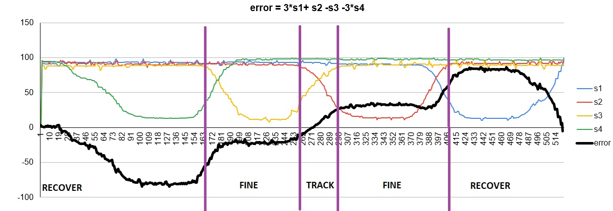

# Vonalkövető Projekt

## Dokumentálás célja
- Memorandum
- Tanulási lehetőség másoknak

Ez a dokumentáció igyekszik megmutatni és összegyűjti mindazt, ami a 2025-ös Prosuli vonalkövető versennyel kapcsolatban készült.

## Előzmény
A vonalkövetési feladatok a robotversenyek leggyakoribb feladatai (FLL, WRO, RoboCup, RobotOlimpia, stb.).  
Vonalkövetésről készítettünk egy tanulmányt 2015-ben, Prezi formában még elérhető: [prezi](https://prezi.com/3eiayjo-uein/lego-robot-programozas/)

## Versenyszabályzat a magyar versenyről
- [Szabályok mentett](mds/2025.Line Following Rules.hu.v.04.07..md)
- [Szabályok mentett](mds/2025.Line%20Following%20Rules.hu.v.04.07..md)
- [Szabályok online](https://docs.google.com/document/d/1thQl6xXX_qvgtK1BIwJ8JObkCabkKbEllVdfRe9Oe6A/edit?pli=1&tab=t.0#heading=h.xe0xnnmimg7h)

## Versenyszabályok a nemzetközi versenyről
- [Szabályok online](https://robotex.international/wp-content/uploads/2024/07/Line-following-2024-ENG.pdf)

## Inspirációs videók
[!](https://youtu.be/MHesNWMKTPU)

## RobotC fejlesztőkörnyezetről
A RobotC a LEGO EV3 programozásában **közvetlen hardvervezérlést** kínál, ami gyors és precíz működést tesz lehetővé a grafikus (EV3-G) vagy Python megoldásokhoz képest.

---

### Előnyök

- **Valós idejű hardver-hozzáférés**  
  Motorok és szenzorok állapota azonnal olvasható és írható.

- **Precíz vezérlés**  
  Pontos ciklusok, időzítés és komplex algoritmusok közvetlen implementálása. Ideális PID szabályozáshoz vagy vonalkövetéshez.

- **Részletes hibakeresés**  
  A változók és szenzorértékek futás közben nyomon követhetők.

- **Teljes hardverhozzáférés**  
  Minden motor és szenzor közvetlenül vezérelhető, nincs „elrejtett réteg”.

---

### Összehasonlítás más megoldásokkal

| Megoldás | Előnyök | Hátrányok |
|----------|---------|-----------|
| **EV3-G (grafikus)** | Egyszerű, vizuális blokkok | Korlátozott hardver-hozzáférés |
| **Python (főiskolai verziók)** | Könnyen olvasható, magas szintű | Lassabb reakcióidő, kevésbé precíz |
| **RobotC** | Gyors, valós idejű, precíz | Több kódolást igényel, kevésbé vizuális |

### A Következő képen a Magyar nemzeti döntőben nyertes robotunk és a képre kattintva a videó a versenyszereplésről:
A programról: robotC-ben készült. A két középső szenzorral kétágú vonalkövés, a két szélső a vonal elhagyását detektálja.
[!](https://youtube.com/shorts/WkEWVOLTY2w?feature=share)

## Robot kialakítása

Az inspiráció videójában látható konstrukció hardver paraméterei:
- EV3 Brick
- Power Functions → Powered Up adapter
- LEGO Power Functions L-Motor (88003)
- 3 db Color Sensor

### Várt előnyök
- Az L-motornak köszönhetően 380 fordulat/perc sebesség.
- 3 szenzor elhelyezésének köszönhetően a szenzorok súlyozott összege pontos és PID vonalkövetést tesz lehetővé. A vonal elvesztését a szélső szenzoroknak kell detektálniuk.
- RobotC fejlesztőkörnyezetnek köszönhetően a ciklusidő 2 ms alatt van. Így a legnagyobb sebesség esetén is a vonalon való áthaladásról több szenzorérték is elérhető a programban.

**Elért eredmények**
- Finomhangolt PID, nagy sebesség mellett is.
- Megoldatlan probléma: a tesztpályán 90°-os törésnél a robot elvesztette a vonalat, mert a szenzoradatokból eldönthetetlen volt, hogy melyik oldalra hagyja el a vonalat. Ennek magyarázatát a következő ábra mutatja:

| Leírás | Diagram | 
|----------|-----------|
| A diagramon a sarokra ráfutó robot 3 szenzorja által gyűjtött szenzorértékek vannak megjelenítve. Tisztán látszik, hogy nagyon hasonló a két minta, mégis az egyiken jobbra, a másikon balra hagyja el a vonalat. Így nem találtunk megoldást, hogy meghatározzuk merre halad a vonalat. | A szenzorok: S1 bal, S2 középső, S3 jobb szenzor. Az is látszik a diagramon, hogy az S2 hamarabb elhagyja a vonalat, miközben a másik kettő érzékeli a vonalat, de nem csak érintőlegesen, hanem rajta van, majd hirtelen eltűnik mindkét szélső szenzor számára, így nem lehet eldönteni, merre tűnt el!  |

### 3 vagy 4 szenzor?

| Leírás | Diagram | 
|----------|-----------|
| A három szenzor esetén sok információ érkezik a vonal környezetéből, pontos az error meghatározása!   **error = -S1 + S3 / (S1 + S2 + S3)**. Az error jelenti azt a távolságot, amely a vonal középvonalától a szenzorcsoport közepéig tart. 4 szenzor esetén a képen látható elhelyezésből nagy területről jön információ, viszont nem olyan precíz az error, mint 3 szenzor esetén. |  |

### 4 szenzorral hogyan határozzuk meg a vonaltól való távolságot?

Ha egymás mellett helyezzük el a szenzorokat, akkor egyszerre **egy** vagy részben **két** szenzor látja a vonalat.  
- Ha a két középső látja részben, akkor jó helyen van.  
- Ha csak a középsők közül az egyik, akkor kis korrekcióra van szükség.  
- Ha a szélsők valamelyike, akkor nagy korrekcióra van szükség.  
- Ha egyik sem, akkor elvesztette a vonalat!  



# Line Follower Robot – Modulok és Alapelvek Dokumentáció

Az alábbi pontok a line-follower robot működéséhez szükséges főbb technikai területeket, algoritmusokat és szoftvermintákat foglalják össze.  
Mindegyik pont tartalmazza:  
- **Mit kell érteni?** (elmélet)  
- **Miért fontos?** (rendszer szintű szerep)  
- **Hogyan valósul meg nálunk?** (konkrét megvalósítás a kódban)  

---

## 1️⃣ Szenzor-normalizálás és linearizálás

### Mit kell érteni?
A nyers fényérzékelő-értékek különböznek:
- eltérő szenzorok,
- eltérő felületek,
- különböző felszerelési távolságok miatt.  

A robotnak egységesített 0–100 skálán kell dolgoznia.

### Miért fontos?
- Pontos hibaszámításhoz  
- PID hangolhatósághoz  
- Környezeti változások tolerálásához  

### Hogyan valósul meg nálunk?
A `Sensors` struktúra tárolja a szenzoradatokat:

```c
typedef struct {
    byte S1, S2, S3, S4;          // normalizált értékek
    byte S1MAX, S2MAX, S3MAX, S4MAX;   // kalibrációs maximumok
} Sensors;
```
A readSensors() függvény:
-	arányosítja: `(SensorValue * 100) / MAX`
-	0–100-ra korlátozza az eredményt.

## 2️⃣ Hibaszámítás (Error Computation)

### Mit kell érteni?
A robotnak tudnia kell:  
- merre van a vonal,  
- milyen erős az eltérés,  
- milyen esetben tűnt el teljesen a vonal.  

A hibaszámítás a PID szabályozó bemenete.

### Miért fontos?
A line-follower stabilitását és gyorsaságát döntően ez határozza meg.

### Hogyan valósul meg nálunk?
A `compute_error()` függvény:  
- Felismeri különböző eseményeket:
  - kereszteződés,  
  - szélső szenzor jelenség,  
  - vonal elvesztése,  
  - irány megjegyzése.  
- Hiba számítása súlyozott bal–jobb eltéréssel:
```c
return (int)(-s->S1*3 - s->S2*1 + s->S3*1 + s->S4*3) / 3;
```

-	állapotfüggő LED visszajelzést is ad. (kis processzoridejű visszajelzés)
A legutolsó irányt az enum tárolja:
```c
enum Direction { MIDDLE = 0, RIGHT = 1, LEFT = -1 };
```

## 3️⃣ Klasszikus PID szabályozás

### Mit kell érteni?
A PID három komponensből áll:  
- **P** arányos (hiba nagysága),  
- **I** integráló (hosszú távú eltérés korrekciója),  
- **D** deriváló (hiba változási sebessége).  

### Miért fontos?
A robot így:  
- rezgésmentesen,  
- gyorsan,  
- kis túllendüléssel képes követni a vonalat.  

### Hogyan valósul meg nálunk?
A `PID` struktúra:

```c
typedef struct {
    float Kp, Ki, Kd;   // PID paraméterek
    float I, D;         // aktuális I és D komponensek
    int error, prevError;  
    Direction lastDir;  // utolsó irány
} PID;
```

A `computePID()` függvény:
- Számolja az I és D tagokat,
- Előző hibát tárolja,
- A kimenetet korlátozza motorvezérléshez:

```c
pid->D = pid->error - pid->prevError;

float output =
        pid->Kp * pid->error +
        pid->Ki * pid->I +
        pid->Kd * pid->D;

pid->prevError = pid->error;

if(output > 50) output = 50;
if(output < -50) output = -50;
```

## 4️⃣ Sebességkezelés és adaptív PID

### Mit kell érteni?
A robot motorjai nem azonnal érik el a kívánt sebességet, a gyorsulás és lassulás különböző dinamikát mutat.  
- **Exponenciális mozgóátlag (EMA)** segít a sebesség becslésében,  
- **Adaptív PID** lehetővé teszi, hogy a PID paraméterek a robot sebességéhez és a pálya típusához igazodjanak.  

### Miért fontos?
- Stabil vonalkövetés gyorsan változó pályán,  
- Kisebb rezgés és túllendülés,  
- Motorok védelme túl gyors változások esetén.  

### Hogyan valósul meg nálunk?
A `SpeedHandler` struktúra tárolja a sebességbecslést és az adaptív PID paramétereket:

```c
typedef struct {
    float estimatedSpeedA;
    float estimatedSpeedD;
    float alpha;               // EMA súly
    AdaptivePID adaptive;      // adaptív PID paraméterek
} SpeedHandler;
```
A sebességbecslés (EMA) a főciklusban történik:
```c
float alphaA = (motorA_power > sh->estimatedSpeedA) ? alpha_accel : alpha_decel;
float alphaD = (motorD_power > sh->estimatedSpeedD) ? alpha_accel : alpha_decel;

// Sebesség becslés
sh->estimatedSpeedA += (motorA_power - sh->estimatedSpeedA) * alphaA;
sh->estimatedSpeedD += (motorD_power - sh->estimatedSpeedD) * alphaD;

// Átlagsebesség
float avgSpeed = (sh->estimatedSpeedA + sh->estimatedSpeedD) * 0.5;

```
A PID paraméterek adaptív módon változnak:
```c
if(avgSpeed < sh->adaptive.speedThreshold) {
    pid->Kp = sh->adaptive.Kp_slow;
    pid->Ki = sh->adaptive.Ki_slow;
    pid->Kd = sh->adaptive.Kd_slow;
} else {
    pid->Kp = sh->adaptive.Kp_fast;
    pid->Ki = sh->adaptive.Ki_fast;
    pid->Kd = sh->adaptive.Kd_fast;
}
```
- `alpha_accel` lassú gyorsuláshoz,
- `alpha_decel` gyors lassuláshoz,
- `speedThreshold` határozza meg, mikor vált a PID paraméter.

## 5️⃣ Főprogram és cikluskezelés

### Mit kell érteni?
A robot működése ciklikus: minden ciklusban olvassa a szenzorokat, számítja a hibát, frissíti a PID-et és vezérli a motorokat.  
- Fontos a ciklusidő 2 ms alatt tartása a stabil vonalkövetéshez. (kerülni kell  nagy processzoridejű kódokat)  
- A hibák, sebesség és ciklusok nyomon követése segít a finomhangolásban.

### Miért fontos?
- Stabil és gyors vonalkövetés,  
- Hibák és rezgések csökkentése,  
- Tesztelés és debug egyszerűsítése.

### Hogyan valósul meg nálunk?
A `Debug` struktúra tárolja az idő és ciklusadatokat:

```c
typedef struct {
    long startTime;  // program indítási ideje
    int ciklus;      // futott ciklusok száma
} Debug;
```
A főciklus felépítése:
```c
while(nSysTime - dbg.startTime < 10000) {  // 10 másodperc
    readSensors(&s);                        // szenzorok olvasása
    pid.error = compute_error(&s, &pid);    // hibaszámítás
    handleSpeedAndPID(&sh, &pid, motor[motorA], motor[motorD]);//sebesség becslés, adaptív PID paraméterek állítása
    int correction = computePID(&pid);      // PID számítás
    motor[motorA] = 50 - correction;        // motorvezérlés
    motor[motorD] = 50 + correction;
    dbg.ciklus++;                            // ciklusszámláló
    wait1Msec(1);                            // rövid várakozás
}
```
Ha kilépett a főciklusból akkor lehet:
- adatokat kiírni a kijelzőre.
- mentett adatokat fájlba írni.

## 6️⃣ LED visszajelzés és állapotfigyelés

### Mit kell érteni?
A robot vizuális visszajelzést ad a működési állapotáról a LED segítségével:  
- Piros LED → vonal elvesztése vagy kritikus helyzet  
- Zöld LED → szélső szenzor jelez, kisebb korrekció  
- Kioltott LED → normál működés, vonal középen  

Ez segít a fejlesztés és a finomhangolás során azonnal érzékelni a robot aktuális állapotát.

### Miért fontos?
- Gyors vizuális visszajelzés a hibák és kritikus események azonosításához  
- Tesztelés közben látható a robot reakciója a vonal jelére  
- Debugolás egyszerűsítése

### Hogyan valósul meg nálunk?
A LED vezérlést a `compute_error()` függvény kezeli:

```c
if(s->S1 > 90 && s->S2 > 90 && s->S3 > 90 && s->S4 > 90) {
    setLEDColor(ledRed);   // Vonal elveszett
} else if ((s->S1 > 20 && s->S2 > 90 && s->S3 > 90 && s->S4 > 90) ||
           (s->S1 > 90 && s->S2 > 90 && s->S3 > 90 && s->S4 > 20)) {
    setLEDColor(ledGreen); // Szélső szenzor jel
} else {
    setLEDColor(ledOff);   // Normál működés
}
```
- A LED állapot azonnal tükrözi az aktuális szenzorhelyzetet.
- Segíti a PID finomhangolását és a motorvezérlés helyességének ellenőrzését.

## 7️⃣ Sebességbecslés és adaptív PID

### Mit kell érteni?
- A robot motorjai gyorsulnak és lassulnak a parancsok hatására, de a tényleges sebesség lassabban követi a beállított értéket.
- Az Exponential Moving Average (EMA) technikát használjuk a sebesség becslésére.
- Két alfa érték van:  
  - Lassú gyorsulás (alpha_accel)  
  - Gyors lassulás (alpha_decel)

### Miért fontos?
- A robot stabilabb követést biztosít nagyobb sebességnél is.
- Finomítja a PID szabályozó reakcióját, mert a motor valós állapotát figyelembe veszi.
- Minimalizálja a túllendülést és rezgést a motorváltozásoknál.

### Hogyan valósul meg nálunk?
A `handleSpeedAndPID()` függvény végzi a számítást:

```c
float alphaA = (motorA_power > sh->estimatedSpeedA) ? alpha_accel : alpha_decel;
float alphaD = (motorD_power > sh->estimatedSpeedD) ? alpha_accel : alpha_decel;

// Sebesség becslés EMA-val
sh->estimatedSpeedA += (motorA_power - sh->estimatedSpeedA) * alphaA;
sh->estimatedSpeedD += (motorD_power - sh->estimatedSpeedD) * alphaD;

// Átlagos sebesség
float avgSpeed = (sh->estimatedSpeedA + sh->estimatedSpeedD) * 0.5;

// Adaptív PID paraméterválasztás
if(avgSpeed < sh->adaptive.speedThreshold) {
    pid->Kp = sh->adaptive.Kp_slow;
    pid->Ki = sh->adaptive.Ki_slow;
    pid->Kd = sh->adaptive.Kd_slow;
} else {
    pid->Kp = sh->adaptive.Kp_fast;
    pid->Ki = sh->adaptive.Ki_fast;
    pid->Kd = sh->adaptive.Kd_fast;
}
```

- estimatedSpeedA és estimatedSpeedD tárolja a motorok aktuális becsült sebességét.
- alpha_accel lassítja a gyorsulást, alpha_decel gyorsítja a lassulást.
- Az adaptív PID paraméterek automatikusan változnak a robot sebességéhez illeszkedve.

 ## 8️⃣ Fő ciklus és statisztika

### Mit kell érteni?
- A fő ciklus a robot „szíve”, ahol minden iterációban:
  1. Beolvassuk a szenzorok értékeit
  2. Számítjuk a hibát a vonalhoz képest
  3. PID számítást végzünk
  4. Motorokra alkalmazzuk a korrekciót
  5. Becslést végzünk a motorsebességről
- A ciklusidő nagyon rövid (~2 ms), hogy a robot gyorsan reagáljon a vonal változásaira.

### Miért fontos?
- A stabil és gyors vonalkövetés ezen ciklus hatékonyságán múlik.
- A hibaszámítás, PID és motorvezérlés szoros integrációja biztosítja a rezgésmentes mozgást.
- Statisztikák (átlagos ciklusidő, futott ciklusok, eltelt idő) segítik a finomhangolást és hibakeresést.

### Hogyan valósul meg nálunk?
- A `task main()` tartalmazza a végtelen ciklust, melyet 10 másodpercig futtatunk.
- Debug struktúrában tároljuk a futott ciklusok számát és a startidőt.
- A motorvezérlés a PID kimenetét használja, sebességbecsléssel kiegészítve.
- A végén kiírjuk a statisztikát a kijelzőre:

```c
long elapsed = nSysTime - dbg.startTime;   
float avgCycle = (float)elapsed / dbg.ciklus;

eraseDisplay();
displayBigTextLine(3, "Ciklusok: %d", dbg.ciklus);
displayBigTextLine(5, "Eltelt: %d ms", elapsed);
displayBigTextLine(7, "Atlag: %.2f ms", avgCycle);
displayBigTextLine(1, "%d %d %d %d", s.S1,s.S2,s.S3,s.S4);
 ```
- Ez lehetővé teszi a ciklusidő optimalizálását és a PID finomhangolását.
- Rövid várakozás (wait1Msec(1)) biztosítja a stabil időzítést és CPU-kímélést! Tényleg fontos!

  
